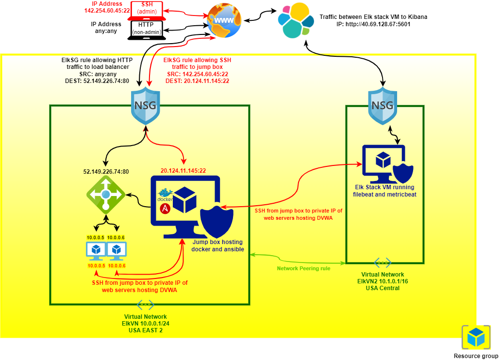
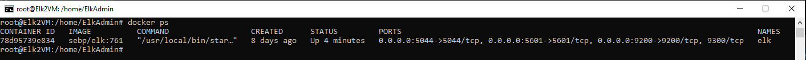

# ***Automated Elk Stack Deployment***

***The files in this repository were used to configure the network depicted below.***

These files have been tested and used to generate a live ELK deployment on Azure. They can be used to either recreate the entire deployment pictured above. Alternatively, select portions of the YAML file may be used to install only certain pieces of it, such as Filebeat. A complete linked list of components can be found at the end of this document. For Azure setup references please refer to the [Asure and Kibana Screens](Azure_and_Kibana_Screens) directory on Github.

### **This document contains the following details:**
- Description of the Topology
- Access Policies
- ELK Configuration
  - Beats in Use
  - Machines Being Monitored
- How to Use the Ansible Build

### **Description of the Topology**

The main purpose of this network is to expose a load-balanced and monitored instance of DVWA, the D*mn Vulnerable Web Application to the internet allowed through port 80 using http while administrating and modifying the network via a single access point using port 22 and ssh.

Load balancing ensures that the application will be highly available, in addition to restricting access to the network. In the case of a virtual web machine failure in the back-end pool the load-balancer will distribute traffic to the redundant virtual web machines in order to maintain uninterrupted access. The load-balancer also serves as protection against DDoS attacks and other unauthorized, again through traffic distribution between machines and various security measures. This also helps maintain availability of  the hosted publicly available site.
In using a jump box provisioner, modification and deployment of scripts to machines in the sub/network is automated and controlled from a single source. Using this particular model many changes can be applied to each virtual machine contained within the virtual network and resource group efficiently, whether the changes apply to one virtual machine, a group of virtual machines, or all virtual machines contained within the sub/network. This excludes some resources on or within the perimeter of the sub/network, such as the NSG or the load-balancer, as they must be configured within Azure.

Integrating an ELK server allows users to easily monitor the vulnerable VMs for changes to the logs and system metrics. Within the ELK stack model demonstrated Filebeat monitors specified log files and locations, and forwards each flagged event to Elasticsearch (http://40.69.128.67:5601) where the logs are indexed for analysis.
Within the same model Metricbeat instead collects operating system and running service metrics from the servers specified, also forwarding them to  Elasticsearch (http://40.69.128.67:9200/) for analysis.
As such, both tools together provide a general overview of events occurring in the sub/net whether from external source or internal function.

The configuration details of each machine may be found below.

|   | Name                | Function                     | Public/Private IP Address | Operating System      |   |
|---|---------------------|------------------------------|---------------------------|-----------------------|---|
|   | ----------          | ----------                   | ------------              | ------------------    |   |
|   | Jumpbox-Provisioner | Gateway                      | 20.124.11.145/10.0.0.4    | Ubuntu 18_04-lts-gen2 |   |
|   | Elk2VM              | VM hosting Elk Stack         | 40.69.128.67/10.1.0.4     | Ubuntu 18_04-lts-gen2 |   |
|   | Web 1               | Web Server VM hosting Docker | No Public IP/10.0.05      | Ubuntu 18_04-lts-gen2 |   |
|   | Web 2               | Web Server VM hosting Docker | No Public IP/10.0.06      | Ubuntu 18_04-lts-gen2 |   |

### **Access Policies**

Only the jump box machine can accept public connections from the internet (excepting the back-end pool virtual machines), as determined by the load-balancer rule set to allow throughput from its public IP address on port 80). Access to the jump box machine is only allowed from the following IP address: 142.254.60.45:22

A summary of the access policies in place can be found in the table below.

|   | Name                | Publicly Accessible   | Allowed IP Addresses   |   |
|---|---------------------|-----------------------|------------------------|---|
|   | ----------          | --------------------- | ---------------------- |   |
|   | Jumpbox-Provisioner | Yes                   | 142.254.60.45:22       |   |
|   | Elk2VM              | No                    | 142.254.60.45:5601     |   |
|   | Web 1               | No                    | 52.149.226.74:80       |   |
|   | Web 2               | No                    | 52.149.226.74:80       |   |

### **Elk Configuration**

Ansible was used to automate configuration of the ELK machine. No configuration was performed manually, which is advantageous as this method lends itself to consistency and efficiency. As a single set of ansible scripts and configuration modifications on a single source machine can be used to set up myriad machines. It reduces the possibility of error (because there is only one script set to debug) as well as deployment time (because there is only one script set to deploy).

### **The playbook implements the following tasks:**

1. Install and deploy docker on target machine and initialize container
2. Install Elasticsearch in container using conifguration file and playbook 
3. Install Logstash in container using conifguration file and playbook 
4. Access Kibana via web browser to ensure proper funtionality

#### ***The following screenshot displays the result of running `docker ps` after successfully configuring the ELK instance.***

### **Target Machines & Beats**
This ELK server is configured to monitor the virtual machines comprising the back-end pool, Public IP 52.149.226.74/Private IP 10.0.0.5 and 10.0.0.6, as well as Public IP 20.124.11.145, using Metricbeat and Filebeat.

These Beats allow us to collect the following information from each machine: Filebeats collects log files and locations. Metricbeats collects running service and OS information. Each ship colleted information to a designated output.

### **Using the Playbook**
In order to use the playbook, you will need to have an Ansible control node already configured. Assuming you have such a control node provisioned: 

#### **SSH into the control node and follow the steps below:**
1. Copy the ansible.config file to the /etc/ansible directory within your ansible container as well as desired playbooks. Copy the filebeat.yml and filebeat-config.yml files to /etc/ansible/roles and metricbeat.yml and metricbeat-config.yml to /etc/ansible/metricbeat.
2. Update the Ansible config file to include all VM IP ranges (webservers and Elk stack VM). Following each entry include the python interpreter: ansible_python_interpreter=/usr/bin/python3
3. Run the playbooks, and navigate to [yourdocker_containername] to verify the installations.
4. Open http://ElkServerublicIP:5601/app/kibana in a web browser to view Kibana.

-  **install_ELK_stack.yml** is the playbook for installing ELK to the VM in the second subnet. It is copied to and run from the /etc/ansible directory.
- the **hosts** file must be updated to reflect your IP ranges, as stated above. This information is also entered in the playbooks (as applicable) to be deployed in order to specify the target machines. Use the corresponding virtual machine address information per playbook.
- Navigate to http://ElkServerublicIP:5601/app/kibana to view logs and metrics.

## Ansible configuration and deployment files

[Ansible config](ansible/ansible.cfg)

[Hosts file](ansible/hosts)

[Docker installation and config](ansible/Config_VM_with_Docker.yml)

[Elk Stack installation](ansible/install_ELK_stack)

[Filebeat config](ansible/filebeat-config.yml)

[Filebeat playbook](ansible/filebeat-playbook)

[Metricbeat config](ansible/metricbeat-config)

[Metricbeat playbook](ansible/metricbeat-playbook.yml)

